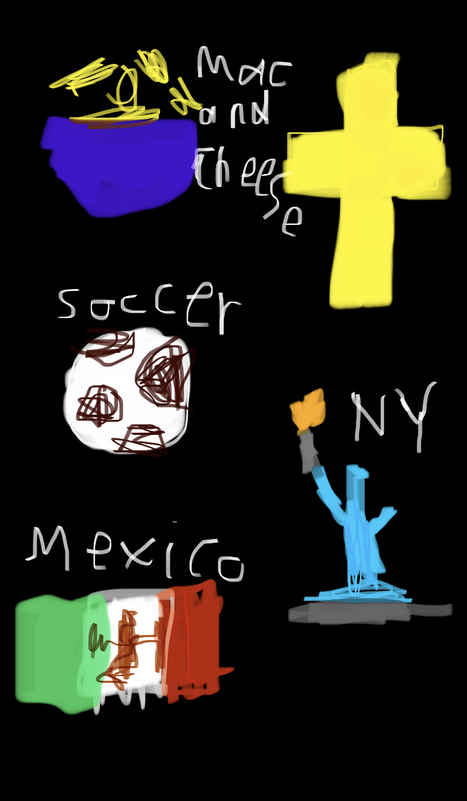

## Miguel's Blog 
Hi, I'm Miguel, welcome to my CSP blog😎!!!!

## A few things about me:
As I started my highschool journey, I found myself looking for classes that would appeal to my curious mindset🤓. That's where I found the AP computer science principles class and sure enough, it peaked my interests. Knowing that my brother had also taken this class, I was excited to learn a new skill that I could apply to the real world!

## Checkout My Sick Freeform!!!

## Troubleshooting
Some of the problems that I faced when setting up my Github page was putting in code to install Jupyter, Python, along with tasks that I needed to complete to get my page functioning. One thing that helped me was going back to the teacher's github page and following the directions more thoroughly. This made me realize that there were little steps in setting up my website that I needed to complete in order to get everything running. My partner, Patrick, also helped me with some of my problems because since he was on a Mac, he had to set up his page differently. These differences would allow one of us to help the other if one of us fell behind because we didn't get stuck on the same problem due to us having different computers.
